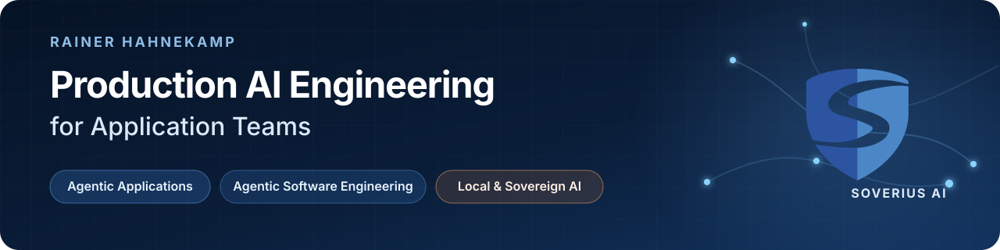

I am an AI engineer at [Soverius AI](https://soverius.ai). I build agentic applications and AI-powered software-engineering workflows, with a strong focus on architectures that can move beyond the prototype stage.

My foundation is application engineering. I am a [Google Developer Expert](https://developers.google.com/community/experts), a member of the [NgRx](https://github.com/ngrx/platform) core team, and a co-maintainer of the Angular integration in [CopilotKit](https://github.com/CopilotKit/CopilotKit). Angular is where I have built deep expertise; the systems and engineering problems I work on are not limited to one frontend framework.

### What I work on

- **Agentic Applications** — agents, generative UI, AG-UI, A2UI, MCP Apps, shared application state, tool use, and human approval.
- **Agentic Software Engineering** — coding agents, context and harness engineering, tools, skills, evaluations, and reliable feedback loops.
- **Local & Sovereign AI** — model evaluation, local inference, privacy, deployment, cost control, and hybrid local/cloud architectures.

### Selected engineering work

| Project | What it demonstrates |
| --- | --- |
| [CopilotKit](https://github.com/CopilotKit/CopilotKit) | Production-oriented agentic applications and generative UI across frontend frameworks |
| [Angular A2UI MacroQuest](https://github.com/Soverius-AI/angular-a2ui-macroquest) | An Angular reference application combining A2UI, agents, and generative interfaces |
| [Software Development Workflow with Local LLMs](https://github.com/Soverius-AI/software-development-workflow-local-llms) | A durable software-engineering workflow built around coding agents and local models |
| [NgRx](https://github.com/ngrx/platform) | State management and application architecture for Angular |
| [Testronaut](https://github.com/testronaut/testronaut) | Modern frontend testing with Playwright |
| [Sheriff](https://github.com/softarc-consulting/sheriff) | Lightweight, enforceable module boundaries for TypeScript projects |

### Research, teaching, and community

I turn engineering work into open-source examples, articles, talks, workshops, and architecture guidance. On [my YouTube channel](https://www.youtube.com/@RainerHahnekamp), I publish deeper engineering videos for my established developer audience. I also run [ng-news](https://www.youtube.com/channel/UCpNgAFB5-_3WSHD_olBv7nw), a weekly video update for the Angular community.

[Soverius AI](https://soverius.ai) · [YouTube](https://www.youtube.com/@RainerHahnekamp) · [Articles](https://www.rainerhahnekamp.com) · [ng-news](https://www.youtube.com/channel/UCpNgAFB5-_3WSHD_olBv7nw)
